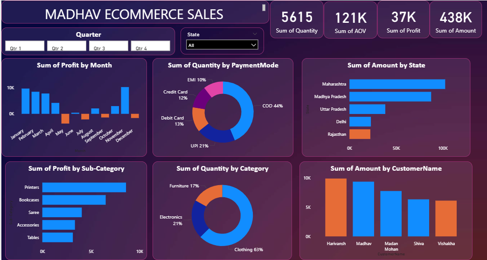

# Madhav Sales Dashboard
## Overview

The owner of Madhav Store wants to track and analyze online sales across India to gain better insights into business performance.
This project involves creating an interactive sales dashboard that helps monitor sales, profit, customer behavior, and payment trends to support data-driven decision making.

## Objectives

 * Track overall sales, profit, and order quantity
 * Analyze state-wise sales performance across India
 * Identify top-selling categories and sub-categories
 * Understand customer purchasing behavior
 * Analyze payment mode preferences
 * Monitor monthly and quarterly profit trends

## Key Performance Indicators (KPIs)

 * Total Quantity Sold: 5,615
 * Total Average Order Value (AOV): 121K
 * Total Profit: 37K
 * Total Sales Amount: 438K

## Dashboard Insights
**Payment Mode Analysis**

 * Cash on Delivery (COD) is the most preferred payment mode.
 * UPI and card payments also contribute significantly.

**State-wise Sales**

Highest sales are recorded in:
 * Maharashtra
 * Madhya Pradesh
 * Uttar Pradesh

**Category-wise Quantity Sold**

 * Clothing contributes the highest quantity sold.
 * Electronics and Furniture follow.

**Sub-Category Profit Analysis**

Top profit-generating sub-categories:

 * Printers
 * Bookcases
 * Sarees
 * Accessories
 * Tables

**Monthly Profit Trend**

 * Profits fluctuate across months.
 * Peak profits are observed towards the end of the year.

**Customer-wise Sales**

Top contributing customers include:
 * Harivansh
 * Madhav
 * Madan Mohan
 * Shiva
 * Vishakha

## Conclusion

 * The dashboard helps the Madhav Store owner easily track online sales performance across India.
 * Insights reveal that COD is the most used payment mode, Clothing is the best-selling category, and Maharashtra leads in sales.
 * This dashboard enables better planning for inventory, promotions, and regional marketing strategies.

## Business Recommendations

* Promote digital payment methods with offers to reduce COD dependency
* Focus marketing efforts on high-performing states
* Increase inventory for high-demand clothing products
* Run targeted campaigns during high-profit months
* Reward loyal, high-value customers

## Dashboard

